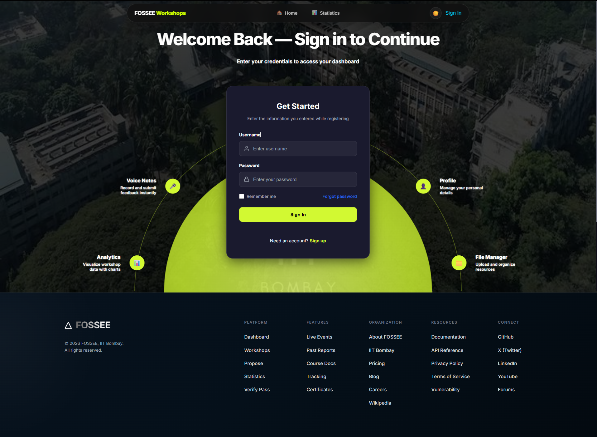
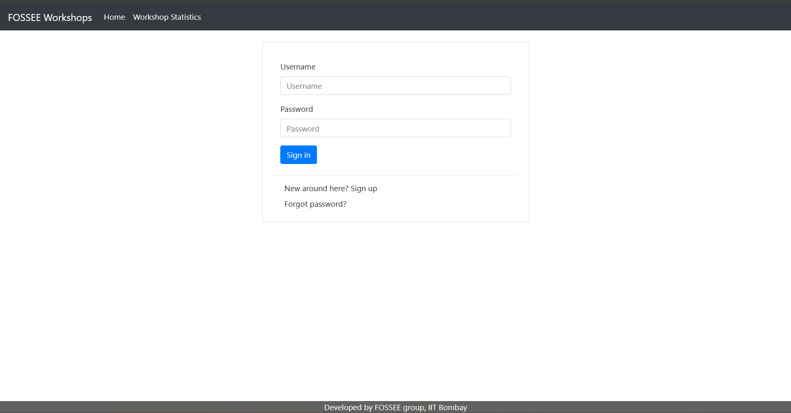
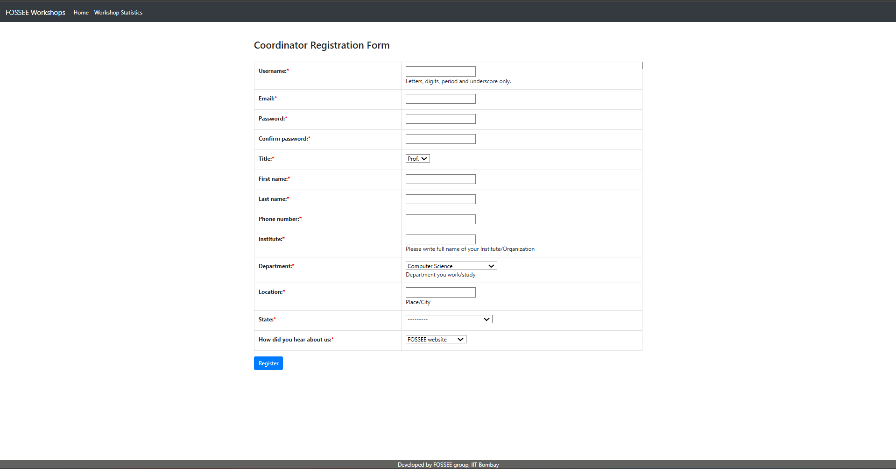
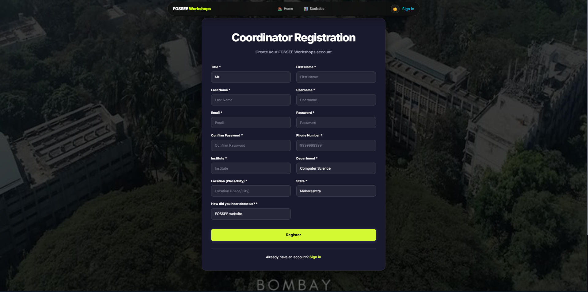
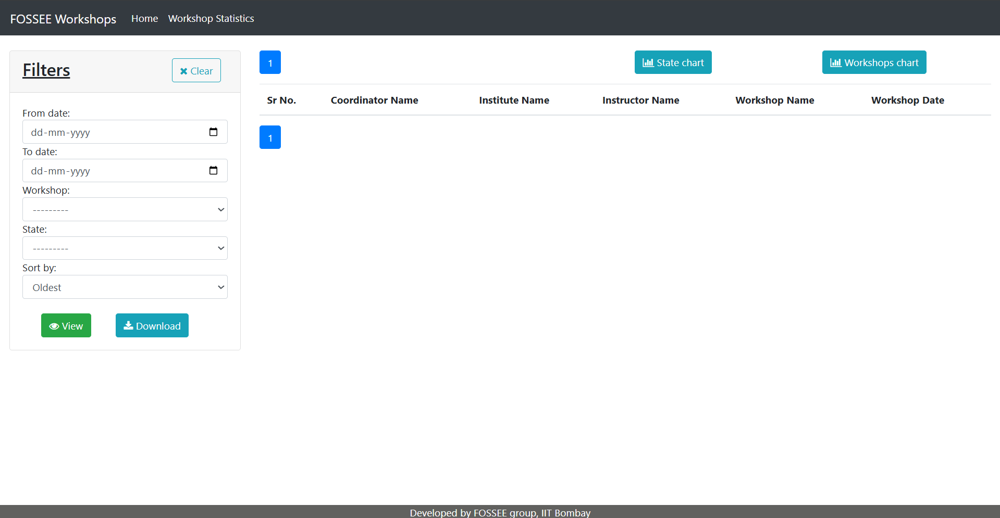
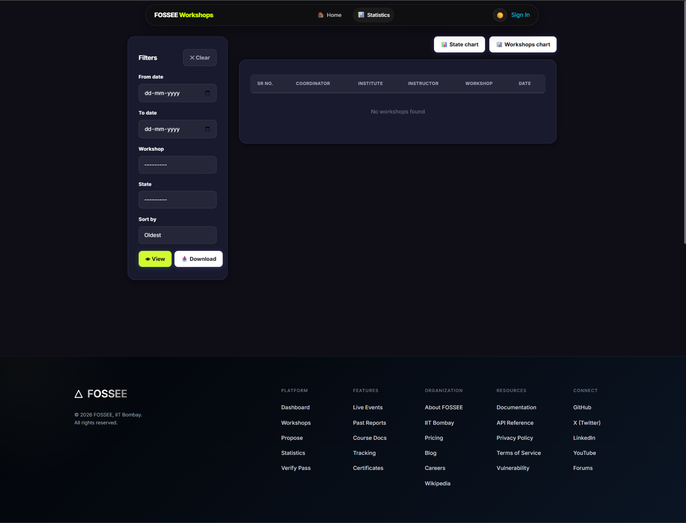

# UI/UX Overhaul: Workshop Booking System

## 📝 Project Summary
This initiative focuses on modernizing the **FOSSEE Workshop Booking** platform. The objective was to transition from a legacy, table-centric interface to a contemporary, responsive experience while preserving the core Django backend functionality.

The redesign emphasizes **user-centric navigation**, **mobile-first responsiveness**, and a **cohesive visual identity** across all system modules.

---

## ✨ Key Improvements & Features

### 🏠 Landing & Navigation
* **Dedicated Home Page:** Introduced a high-impact landing page to replace the immediate login screen.
* **Hero Experience:** Integrated a modern hero section with clear Call-to-Action (CTA) buttons.
* **Branding:** Added side visual panels to enhance aesthetic engagement.
* **Refined Header:** Unified "Login" and "Sign Up" actions into a single, intuitive navigation flow.

### 🔐 Authentication Suite
* **Login Page:** Shifted to a focused, centered card layout with side visual accents.
* **Registration:** Replaced rigid HTML tables with flexible, modern card containers for easier data entry.
* **Password Recovery:** Redesigned the "Forgot Password" and "Reset Success" screens into clean, informative feedback modules.
* **Validation:** Enhanced input styling and added clear, user-friendly error feedback.

### 📊 Administrative Dashboard
* **Stats Page:** Reimagined the statistics view as a functional dashboard UI.
* **Filtering:** Introduced a sidebar-mounted filter panel for rapid data sorting.
* **Visual Hierarchy:** Optimized table alignments and spacing to improve the readability of complex data sets.

---

## 🎨 Design Principles
The project was guided by five core pillars:
* **Clarity:** Reducing cognitive load by eliminating visual clutter.
* **Uniformity:** Enforcing a consistent design language across all authentication and data flows.
* **User Feedback:** Implementing distinct visual states for success, errors, and loading.
* **Accessibility:** Prioritizing high-contrast ratios and touch-friendly interactive elements.
* **Lightweight Performance:** Utilizing native CSS (Flexbox/Grid) instead of bulky UI frameworks to ensure fast load times.

---

## 🛠️ Technical Implementation
**The Challenge:** Transforming a table-based UI into a modern grid without disrupting the existing Django template logic.

**The Solution:**
* **Incremental Refactoring:** A page-by-page style injection strategy.
* **CSS Modernization:** Used flexible containers and hidden decorative elements on mobile to ensure a true mobile-first experience.
* **Backend Compatibility:** Maintained all existing form IDs and logic to ensure the UI remained fully functional with the current backend.

---

## 📸 Visual Showcase

---

### 🔐 Home Page

|  |

### 🔐 Login Page

| Before | After |
|--------|-------|
| |  |

---

### 📝 Registration Page

| Before | After |
|--------|-------|
| |  |

---

### 📊 Workshop Statistics Page

| Before | After |
|--------|-------|
| |  |

---

## 🛠️ Setup Instructions

1. Clone the repository:

```bash
git clone https://github.com/your-username/workshop_booking.git
cd workshop_booking
```

2. Create virtual environment:

```bash
python -m venv env
source env/bin/activate  # Windows: env\Scripts\activate
```

3. Install dependencies:

```bash
pip install -r requirements.txt
```

4. Run migrations:

```bash
python manage.py migrate
```

5. Start server:

```bash
python manage.py runserver
```

---

## ✅ Submission Checklist

* ✔ Clean and structured code
* ✔ Progressive git commits
* ✔ UI improvements across multiple pages
* ✔ README with reasoning and setup
* ✔ Screenshots included

---

## 📬 Submission

Name: Swastika Dey 

Institution Name: VIT Bhopal

Email Id: swastikadey445@gmail.com

Repository link: *https://github.com/Swastikad4/workshop_booking*

---

## 💡 Final Note

The goal of this project was not just visual improvement, but creating a smoother and more intuitive user experience while keeping performance and simplicity in mind.